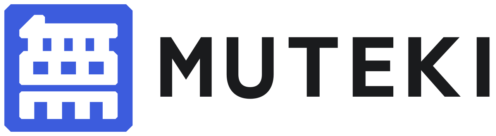
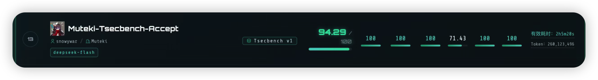
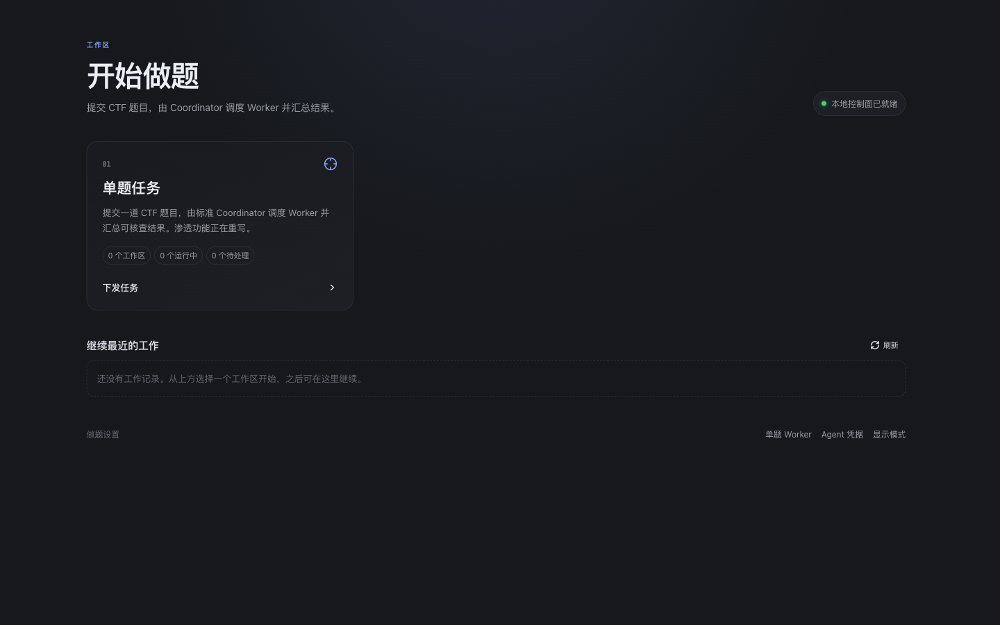
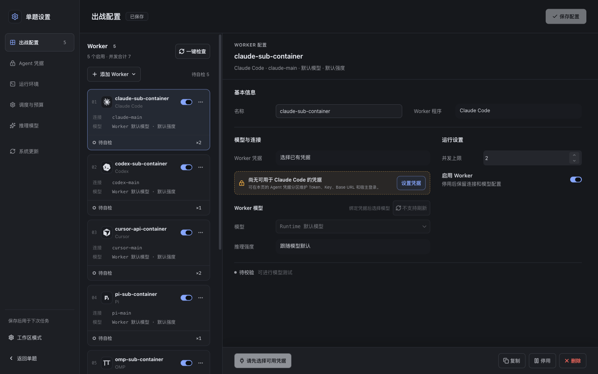
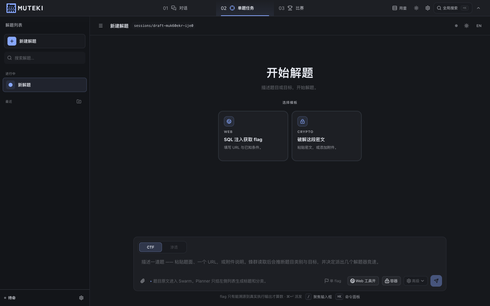
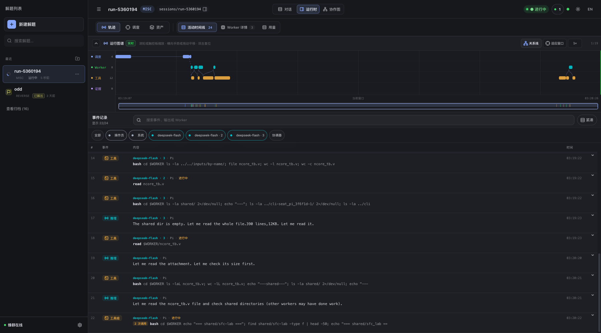
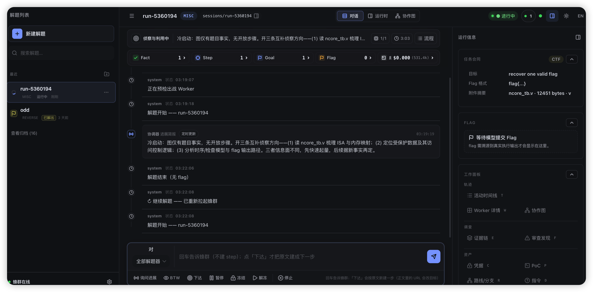
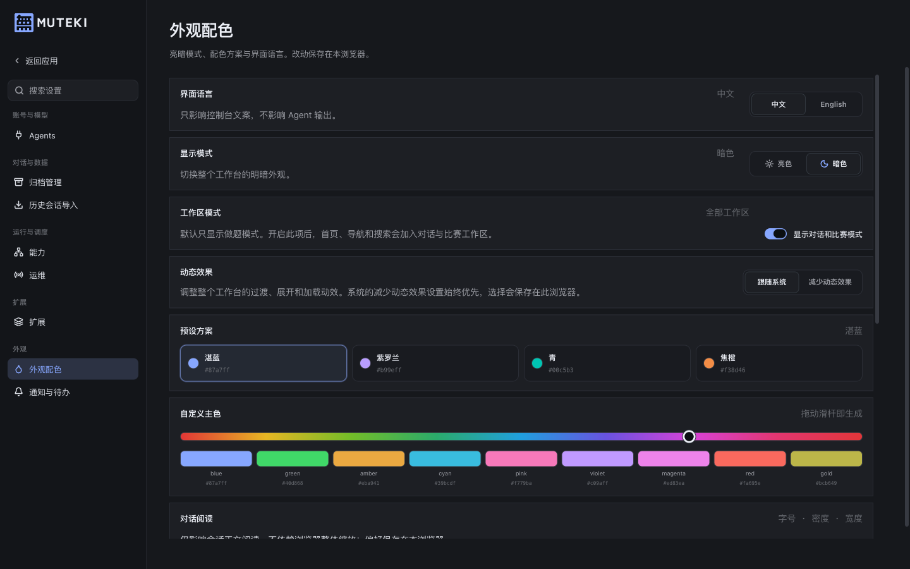
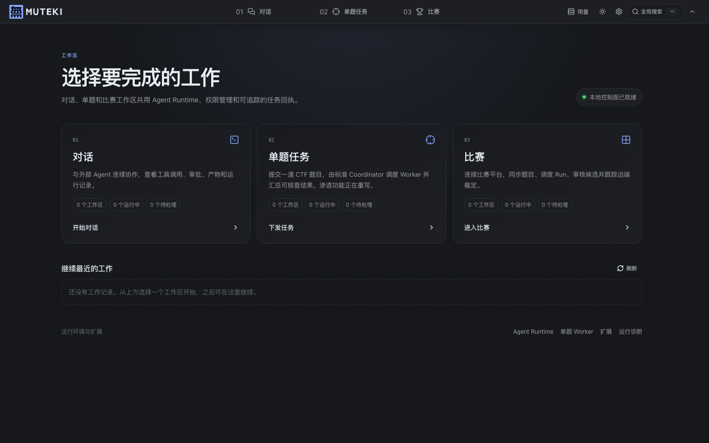
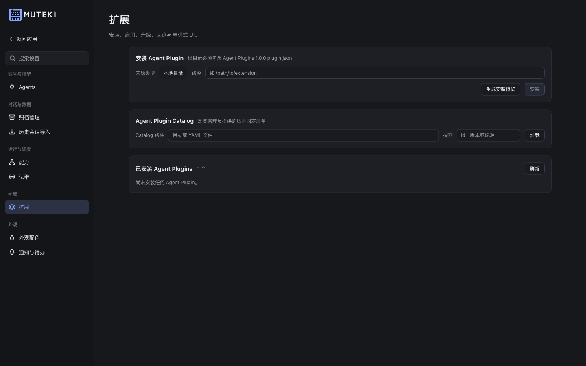

<p align="center">
  <picture>
    <source media="(prefers-color-scheme: dark)" srcset="./assets/logo-dark.png">
    <source media="(prefers-color-scheme: light)" srcset="./assets/logo-light.png">
    
  </picture>
</p>

<h1 align="center">無敵 · Project Muteki</h1>

<p align="center">
  <strong>多模型异构 AI Agent 蜂群 · 自主攻防安全自动化</strong>
</p>

<p align="center">
  <a href="https://github.com/FishCodeTech/muteki/blob/main/LICENSE"></a>
  <a href="https://www.python.org/"></a>
  <a href="https://github.com/FishCodeTech/muteki/stargazers"></a>
  <a href="https://github.com/FishCodeTech/muteki/issues"></a>
  <a href="https://github.com/FishCodeTech/muteki/pulls"></a>
  
  
</p>

<p align="center">
  <a href="README.md">English</a> · <strong>简体中文</strong> · <a href="CHANGELOG.md">版本更新</a>
</p>

<p align="center">
  <a href="https://www.star-history.com/#fishcodetech/muteki&amp;Date">
    <picture>
      <source media="(prefers-color-scheme: dark)" srcset="https://api.star-history.com/svg?repos=fishcodetech/muteki&amp;type=Date&amp;theme=dark">
      <source media="(prefers-color-scheme: light)" srcset="https://api.star-history.com/svg?repos=fishcodetech/muteki&amp;type=Date">
      
    </picture>
  </a>
</p>

---

**無敵 · Project Muteki** 是一款基于Remix Engineering 的开源 多agent协作网络安全框架。

本项目核心是实现了一套ai agent的调度方案，自动、智能化协调控制每个agent的上下文，像蜂群一样，各有分工，但都是为了完成最终的目标。并且可以兼容市面大部分的agent引擎，用于使用，当前可用 Worker 引擎为 Claude、Codex、Cursor、Pi、OMP、Kimi、Grok、OpenCode，后续将逐步支持更多引擎。
项目未来将不断更新，成为all in one，而不是局限于单一安全场景，未来将不断迭代升级，成为成熟的开源agent产品。


> ## ⚠️ 运行前必读
>
> 免责声明：本项目请遵守相关法律，任何未授权的渗透和黑客行为，均与项目作者本人没有任何关系。
>
> Muteki 是**攻击性安全自动化工具**。它驱动 CLI agent 执行命令、调用安全工具、访问目标服务;
> **它不承诺隔离恶意 challenge**。
>
> 推荐**只在专用、可丢弃的环境里运行** —— 专用 VPS、throwaway VM,或无敏感数据的独立机器。不要在
> 你的主力工作机、共享主机或生产环境运行。详见 [SECURITY.md](SECURITY.md)。
>
> 当然我平时都在自己的电脑直接跑，因为配环境比较方便（

---

## 能力如何？

在RIFFHACK2026 3小时全自动无人工接管，速通ak全部题目。获得第八名。


春秋云镜渗透测试靶场blackmaze，三个月0解，muteki 2小时速通一血（为什么平台显示39小时因为期间涉及到各种调试测试多flag的模式支持，所以浪费时间较多，实际解题时间仅花费2小时。）。


春秋云镜全徽章场景ak。

hackthebox全种类 insane、hard难度ak。

nyuctf benchmark全题目测评成绩，可看文章结尾。

tsecbench 成绩：https://tsecbench.zc.tencent.com/agent/22091

tsecbench 托管模式下+deepseek-flash，排名13



更多你们知道和不知道的各种比赛的一血、高分，均有muteki的身影出现，在此不一一赘述。

总之经过为期一个月的工程化优化，架构能力调教。bug修复，本项目正式开源，没有欺骗star，没有吹逼文案，没有打击你们的自信，没有子群，没有社区，没有骗钱，没有付费，没有营销，直接开源共享。

欢迎使用并一同建设升级，遇到的任何问题请随时提issue，欢迎加入交流群。我们共同建设世界最强的ctf agent。（群满了，有需要进群的加我微信）


---

## 版本更新

当前版本为 **0.4.0**。新增功能、行为变化、移除内容及升级说明见 [CHANGELOG.md](CHANGELOG.md)。

---

## 快速开始

> **当前优先体验：CTF 单题模式。** 首页默认只显示“单题任务”；对话、比赛及自定义插件仍在测试中，按下文步骤开启。Web 页面的“渗透”模式正在重写，当前不可选。

### 1. 准备环境并启动

需要 [uv](https://docs.astral.sh/uv/)（Python 依赖管理）、Python 3.13 或更新版本，以及 Node.js/npm（Web 界面）。本地做题还需要至少安装并登录一个受支持的 Agent CLI。`./init.sh` 会同步 Python 依赖；首次启动 Web 时会安装和构建前端依赖。下面是手动启动的最短路径；macOS、Ubuntu 和虚拟机的工具安装步骤见[推荐运行方式与工具安装](#推荐运行方式与工具安装)。

```bash
git clone https://github.com/FishCodeTech/muteki.git
cd muteki
./init.sh
./run.sh web
```

浏览器打开 **http://127.0.0.1:3001**。默认仅监听本机地址；后端默认端口为 `8000`。第一次构建前端和初始化服务可能需要一些时间，以终端显示的地址和就绪信息为准。停止服务用 `Ctrl+C`。



### 2. 完成最小配置

1. 在首页点“单题 Worker”，或进入单题页面后点左下角“Worker 设置”。
2. 在“Agent 凭据”中确认已有的 CLI 登录可用，或新增 Token、API Key、自定义 Base URL 等凭据；使用“真实连通测试”检查连接。
3. 回到“出战配置”，选择至少一个已启用的 Worker，为它绑定可用凭据和模型；点“一键检查”或单独自检。
4. 在“运行环境”中选“本地运行”（使用宿主机 CLI）或“容器运行”（需要 Docker、Worker 镜像及可注入凭据）。
5. 在“推理模型”中为 Planner 选择模型端点和端点模型，并运行页面提供的测试；按需配置 Titler。
6. 点右上角“保存配置”，再返回“单题任务”开始做题。

本地运行可继承 CLI 已有的宿主登录；容器运行不能直接继承宿主登录，需在凭据页绑定可注入凭据。若只想尽快跑通，先选一个已能在终端正常调用的 CLI 与“本地运行”。



### 3. 提交第一道题

进入“单题任务”，把**题目名称、原文、目标地址、已知条件和 Flag 格式**写进输入框；附件可通过按钮、粘贴或拖拽加入。检查单/多 Flag、Web 工具、运行环境及“高级”选项后，点“派发蜂群”（Mac 可用 `⌘↵`）。没有指定类别时，系统会根据题面推断。首次运行还需准备工作区与 Worker，请等待状态变化。一般默认即可。



> 只对你拥有或获授权的题目与目标运行。Worker 可以执行命令并访问目标服务。

## 推荐运行方式与工具安装

项目已在 **macOS 26** 和 **Ubuntu 24.04** 上进行相关测试。Windows 主机推荐通过 VMware 运行 Ubuntu 24.04 虚拟机，在虚拟机内安装 Muteki。

| 运行方式 | 应用与 Worker 在哪里运行 | 工具准备 |
| --- | --- | --- |
| **macOS 本机** | Web 与 Worker 都在 Mac 上 | 运行 `./ctf-tools/setup.sh` 安装原生 CTF 工具 |
| **macOS + Docker** | Web 在 Mac 上，Worker 在 Docker 容器内 | 拉取完整 Worker 镜像；容器内已含 CTF 工具链 |
| **Ubuntu 24.04 本机** | Web 与 Worker 都在 Ubuntu 上 | 安装脚本加 `--with-ctf-tools`，或单独运行 `./ctf-tools/setup-ubuntu.sh` |
| **Windows + VMware** | Windows 只作为宿主和浏览器；Muteki 与 Worker 在 Ubuntu 24.04 虚拟机内 | 在虚拟机里运行 Ubuntu 一键安装脚本 |

### 1. macOS 本机直接运行

先安装 Homebrew、Node.js/npm 和准备使用的 Agent CLI；CLI 的登录由各厂商完成。仓库根目录执行：

```bash
./init.sh
export PATH="$HOME/.local/bin:$PATH"  # 若新安装的 uv 还不在 PATH
./ctf-tools/setup.sh
./run.sh web
```

`setup.sh` 使用 [`ctf-tools/Brewfile`](ctf-tools/Brewfile) 安装 macOS 原生工具，创建目录内的 Python/Ruby 工具环境，并生成统一命令入口；它**不会替你登录 Agent CLI**。完成后在“单题设置 → 运行环境”选择“本地运行”。`run.sh` 检测到 `ctf-tools/.ready` 后会自动加载工具路径。离线字典、知识库等大体积资料可按 [`ctf-tools/README.md`](ctf-tools/README.md) 从 Worker 镜像单独同步；只需要刷新已有工具的入口时可运行 `./ctf-tools/setup.sh --link-only`。macOS 原生工具与 Kali 容器内的 Linux 工具不完全相同。

### 2. macOS + Docker 容器运行

安装 Docker Desktop 并确认它正在运行，然后在仓库根目录执行：

```bash
./init.sh
docker pull ghcr.io/fishcodetech/muteki-worker:latest
./run.sh web
```

在“单题设置 → 运行环境”选择“容器运行”，检查页面显示 Docker 与 Worker 镜像可用，再给出战 Worker 配置**可注入的凭据**。宿主机的 CLI 登录不会直接进入容器。完整 Worker 镜像已带 CTF 工具链，因此这一方式不需要在 Mac 上运行 `ctf-tools/setup.sh`。Web 控制台仍在 Mac 上运行，Worker 按任务由 Docker 启动。

### 3. Ubuntu 24.04 本机直接运行

```bash
git clone https://github.com/FishCodeTech/muteki.git
cd muteki
./scripts/install-ubuntu.sh --backend local --preflight
./scripts/install-ubuntu.sh --backend local --with-ctf-tools
./scripts/install-ubuntu.sh --backend local --check
```

这个安装器准备应用依赖、Node.js、Web 服务和本地 Worker CLI，并调用 `ctf-tools/setup-ubuntu.sh` 安装 Ubuntu 可用的 CTF 工具。当前脚本会安装并检查全部受支持的本地 CLI；Agent CLI 仍需分别完成登录或在设置中配置凭据。默认创建 `muteki-web.service`；Web 密码写在当前用户的 `~/.config/muteki/ubuntu.env`，界面使用 Ubuntu 主机的 `3001` 端口。可选 apt 包可能随镜像源和 CPU 架构不同而缺失，脚本会逐项报告。

若已自行安装并启动 Muteki，只想补装本地 CTF 工具，可先确保 `uv` 可用，再运行 `./ctf-tools/setup-ubuntu.sh`。该脚本目前只测试过ubuntu24.04，其他发行版本的linux，建议让ai进行对应的优化和修改。

安装成功后 `./run.sh web` 会自动加载 `ctf-tools/.ready` 对应的工具路径。

### 4. Windows + VMware 虚拟机

在 VMware 中创建 **Ubuntu 24.04** 虚拟机，把仓库克隆到虚拟机内，然后在虚拟机终端执行与 Linux 本机相同的安装命令：

```bash
git clone https://github.com/FishCodeTech/muteki.git
cd muteki
./scripts/install-ubuntu.sh --backend local --with-ctf-tools
./scripts/install-ubuntu.sh --backend local --check
```

Muteki、Agent CLI、CTF 工具和运行目录都在 Ubuntu 虚拟机内；Windows 只负责打开浏览器。安装完成后在 Windows 浏览器访问 `http://<虚拟机IP>:3001`，使用虚拟机中 `~/.config/muteki/ubuntu.env` 保存的 Web 密码。请让 Windows 能访问虚拟机的 UI 端口；若 VMware 使用 NAT 且无法直连虚拟机 IP，可配置端口转发或改用合适的虚拟网络。后端 API 默认只监听虚拟机回环地址。

## 配置详情说明

| 位置 | 主要内容 | 建议的首次操作 |
| --- | --- | --- |
| **单题设置 → Agent 凭据** | 引擎探测、宿主登录、Token/Key、自定义端点、连接测试 | 确认至少一个可用凭据；不要把密钥写入题面或提交到 Git |
| **单题设置 → 出战配置** | Worker 阵容、引擎、模型、推理强度、启停和每席并发 | 先启用一名可自检通过的 Worker，再逐步增加 |
| **单题设置 → 运行环境** | 本地/容器、容器作用域、网络、镜像及可选 VPN | 不需要 |
| **单题设置 → 调度与预算** | 自动调度/固定并跑、并发、总时长、Worker 数和成本上限 | 先保留默认值；明确资源限制后再调整 |
| **单题设置 → 推理模型** | Planner、Titler 的端点、模型和生成参数 | 至少测试 Planner 的真实请求 |
| **设置 → 外观配色 → 工作区模式** | 是否显示对话和比赛 | 要试用扩展工作区时开启“显示对话和比赛模式” |

**Worker 和 Planner 是两类配置。** Worker CLI 负责实际解题；Planner 负责协调决策、规划步骤和生成任务列表信息。Worker 凭据可在本地复用宿主登录，Planner 则需选到可用的模型端点。自定义兼容端点可以在凭据/模型端点界面添加，随后分别绑定到需要它的 Worker 或 Planner。设置页的“保存配置”用于**下次**任务；正在运行的题目不会因改设置而自动重建。

### 受支持的 Worker 引擎

当前界面可配置 Claude Code、Codex、Cursor、Pi、OMP、Kimi、Grok 和 OpenCode 等 CLI；具体能否使用取决于本机安装、厂商登录和所选运行环境。至少准备其中一个。DeepSeek Harness 由于其没有acp、等provider内容，目前只保留登记信息，暂不可作为出战 Worker。各 CLI 的安装和授权流程以对应厂商说明为准。

**注意：**如果页面显示“待自检”或“没有可用凭据”，先到“Agent 凭据”测试连接，再检查“出战配置”中的凭据绑定、模型和运行环境。自检会发起真实模型请求，可能产生用量。

## 如何做题

### 派发前

- **题面：**尽量提供原文、题目类型、URL/主机端口、Flag 形式，以及你已验证的事实。不要把推测写成已验证结论。
- **附件：**可上传题目文件；运行工作区会保存输入和 Worker 产物，便于后续复盘。
- **单 Flag / 多 Flag：**单 Flag 在取得合格候选后可结束。多 Flag 会继续收集；知道数量就填收集总数，不填时需要留意超时、预算或手动停止。
- **Web 工具：**用于控制 Agent 的 WebSearch、WebFetch 功能，防止agent主动搜索外部内容导致目标偏移。
- **高级：**按题目指定 Flag 格式、允许 Worker 请求人工输入，以及本次运行的时长、Worker 总数和成本预算。格式建议与比赛规则一致。

### 运行中：对话输入框和按钮

运行页可查看协调器消息、Worker 状态、活动记录、证据与候选 Flag。输入框上方可选择“全部解题器”或单个 Worker 作为目标。按钮会随运行状态变化：



| 操作 | 作用 | 什么时候用 |
| --- | --- | --- |
| **直接输入并回车 / 发送** | 把文字作为“提示”传给所选目标，**不新建 Step** | 补充线索、纠正题面、告诉 Worker 已知结果 |
| **下达** | 将输入原文建成下一步；正文中的 URL 可能更新目标 | 明确要求尝试一个新方向或指定步骤 |
| **询问进展** | 汇总已确认结果、正在验证的方向和阻塞项到对话 | 想了解当前状态又不想改动任务 |
| **暂停 / 继续** | 暂停蜂群调度，再恢复运行 | 需要临时检查题目或等待人工信息 |
| **冻结 / 解冻** | 立即冻结正在执行的 Worker，再放行 | 需要更强的即时干预时 |
| **停止** | 结束本次运行并停止 Worker，保留记录 | 目标已变、运行不应继续或达到人工判断的上限 |

“提示”与“下达”不同：例如输入“目录 `/admin` 已确认存在”，直接回车是补充线索；点击“下达”则会把这句话作为新step提交，会新建worker去执行任务，比较适合目标明确的情况。运行中不要反复点击控制按钮，否则会出现问题。



如果 Worker 暂停并向你索取输入，在待处理卡片中回答、提供资源，或选择相应的拒绝/误报处理，让运行继续。

### 出现 Flag 或运行结束后

- **复制 Flag 并到题目平台验证。**
- **标记误报：**如果候选 Flag 被平台判错，在结果区用“标记误报”（单个 Flag 行上的 `×` 也有此作用）。多 Flag 时先选择要否定的那个。此操作会标记候选并重新打开解题。
- **继续做题：**在已结束页面重新拉起完整蜂群，沿用已有证据继续探索。
- **追问 / 生成复盘：**结束后可向解题 Worker 追问，或生成复盘报告。生成成功后，正文会显示在对话中，同时写入该 Run 的 `sessions/<run-id>/workspace/writeup.md`（若自定义了 `MUTEKI_SESSIONS_ROOT`，以该目录为起点）。生成会调用实际整个run的全部上下文进行总结。所以会需要一些时间。

## 测试中的扩展功能

默认首页只显示做题模式；在 **设置 → 外观配色 → 工作区模式** 打开“显示对话和比赛模式”后，首页、导航和搜索会出现“对话”“比赛”。默认关闭。
后续muteki的目标是建设成为一个ai native的融合产品。目前该功能为测试阶段，可能bug较多，如有问题随时反馈。





### 对话工作区（测试中）

从首页进入“对话”，可与外部 Agent 连续协作，并查看工具调用、审批、产物及运行记录。需要先在“设置 → Agents”配置相应 Agent Runtime、凭据和权限。对话中的“引导”取决于接入方式是否支持；若按钮不可用，以页面提示为准。此工作区与 CTF 单题运行的控制按钮不同。

### 比赛工作区（测试中）

从首页进入“比赛”，先建立平台连接并测试，再登记远端比赛 ID。进入比赛工作区后，可同步题目、调度单题 Run、检查候选和跟踪远端提交裁定。页面提供 CTFd、rCTF、GZCTF 等平台连接选项；实际可用能力由连接探测结果决定。涉及平台账号或提交行为时，先在测试比赛中验证流程。

### 自定义 Agent Plugin（测试中）

进入 **设置 → 扩展**（启用全部工作区后可从首页“扩展”直达）。这里可从本地目录、归档、Git、HTTP 或 Catalog 指定来源；扩展根目录需有符合 **Agent Plugins 1.0.0** 的 `plugin.json`。先点“生成安装预览”，检查来源、摘要和权限，再执行安装。已安装插件可在此启用、配置、升级、回滚或卸载。只安装你信任的扩展，插件能力以其 manifest 和安装预览为准。



## 部署与更新

### 本地 Web

```bash
./run.sh web                         # Web 后端 :8000 + 界面 :3001
./run.sh web --backend-only          # 只启动后端
./run.sh web --ui-port 3002          # 更换界面端口
./run.sh web --rebuild-ui            # 修改 UI 源码后强制重建
```

仓库根目录可放 `.env`（从 [`.env.example`](.env.example) 复制）保存 `MUTEKI_*` 环境变量；Shell 已导出的同名变量优先。密钥只放在被 Git 忽略的 `.env` 或 `state/_secrets/` 等路径。若把 Web 绑定到非本机地址，必须设置 `MUTEKI_WEB_PASSWORD`，否则后端会拒绝启动。

### Docker Compose

Compose 启动 FastAPI 与 Next.js 控制面；Worker 由 Docker daemon 按需启动。先准备 Docker 和 Worker 镜像，再设置宿主数据绝对路径及 Web 密码：

```bash
docker pull ghcr.io/fishcodetech/muteki-worker:latest
MUTEKI_HOST_DATA_ROOT=/opt/muteki/data \
MUTEKI_WEB_PASSWORD='请替换为强密码' \
  docker compose up --build
```

界面默认仍在 `http://localhost:3001`。`MUTEKI_HOST_DATA_ROOT` 必须是宿主机上的绝对路径，供控制面和 Worker 访问同一份数据。Docker Desktop 的 macOS 路径经过验证；Windows Compose 路径尚未完成真机端到端验证。更多环境变量见 [`.env.example`](.env.example)，镜像和运行边界见 [SECURITY.md](SECURITY.md)。

### 应用更新与回滚

```bash
./run.sh upgrade --check   # 检查稳定版
./run.sh install            # 安装托管版本
muteki upgrade v0.4.0      # 更新到本次版本
muteki rollback            # 回滚到上一个已安装版本
muteki version             # 查看版本与安装形态
```

Web 的“单题设置 → 系统更新”也提供相应操作。升级前保留 `.env`、`sessions/` 和 `state/`；不要把运行记录或凭据提交进仓库。

## 常见问题

| 现象 | 先检查什么 |
| --- | --- |
| 页面打不开 | 看 `./run.sh web` 输出的地址和端口；检查 Node/npm、首次前端构建，以及 `state/_logs/backend.log`、`state/_logs/ui.log` |
| 找不到可用 Worker | 确认 CLI 已安装并登录，Agent 凭据测试通过；检查 Worker 是否启用、绑定了正确凭据和模型 |
| 容器任务启动失败 | 检查 Docker 服务、Worker 镜像、容器凭据、网络/VPN 和页面“运行环境”状态 |
| Planner 测试失败 | 核对模型端点、端点模型、Key/Base URL 和网络；Worker CLI 可用不代表 Planner 已配置 |
| 看不到对话、比赛或扩展入口 | 在“设置 → 外观配色 → 工作区模式”开启“显示对话和比赛模式” |
| Flag 在平台被判错 | 在结果区标记对应候选为误报，再看继续解题结果；必要时核对题面和 Flag 格式 |
| 多 Flag 任务一直运行 | 检查是否填写收集总数；未指定数量时，达到目标前可能需要手动停止或由预算上限结束 |

## 项目与参与

- **代码导航：**`muteki/` 是后端核心；`apps/web/` 是 FastAPI 服务；`apps/web/ui/` 是 Next.js 界面；`docker/` 是镜像配置。。
- **问题反馈：**功能缺陷和文档问题请到 [GitHub Issues](https://github.com/FishCodeTech/muteki/issues) 提交复现步骤、版本和已脱敏日志。安全漏洞请按 [SECURITY.md](SECURITY.md) 通过私密渠道报告。
- **许可证：**本项目以 [GNU AGPL-3.0](LICENSE) 发布。外部 Agent CLI 和模型服务分别适用其自身的许可、服务条款与费用规则。

## 后续todo：

- [ ] 渗透模式重构
- [ ] src漏洞挖掘模式
- [ ] all in one的agent聊天功能。
- [ ] 全面插件化

## 鸣谢

感谢 [c3](https://github.com/Real-C3ngH) 提供的云镜靶场账号，浪费了很多沙砾，疯狂爆米。

感谢 [l4n](https://github.com/lancer0rz) 师傅提供的灵感，新增的reviwer让整体的解题效率有了质的提升。

感谢 [陈橘墨](https://github.com/Randark-JMT) 师傅提供的靶场资源和writeup，用于大量测试和精调。

~~感谢山姆奥特曼 不封我号~~ 现在已经被封了，我将永远记住他的名字。

~~感谢Dario Amodei 不封我号~~ 现在已经被封了，我将永远记住他的名字。

## 参考文献

本项目的设计和评测参考了以下学术工作:

1. **NYU CTF Bench: A Scalable Open-Source Benchmark Dataset for Evaluating LLMs in Offensive Security**
   Minghao Shao, Sofija Jancheska, Meet Udeshi, Brendan Dolan-Gavitt, et al. *NeurIPS 2024 Datasets & Benchmarks Track*. [arXiv:2406.05590](https://arxiv.org/abs/2406.05590)
2. **Teams of LLM Agents can Exploit Zero-Day Vulnerabilities**
   Richard Fang, Rohan Bindu, Akul Gupta, Daniel Kang. *EACL 2026*. [Paper](https://aclanthology.org/2026.eacl-long.2.pdf)
3. **D-CIPHER: Dynamic Collaborative Intelligent Multi-Agent System with Planner and Heterogeneous Executors for Offensive Security**
   Chenhui Zhang, et al. 2025. [arXiv:2502.10931](https://arxiv.org/abs/2502.10931)
4. **HackSynth: LLM Agent and Evaluation Framework for Autonomous Penetration Testing**
   Lajos Muzsai, David Imolai, András Lukács. 2024. [arXiv:2412.01778](https://arxiv.org/abs/2412.01778)
5. **CTFAgent: An LLM-powered Agent for CTF Challenge Solving**
   Jiaze Sun, et al. *Computers & Security*, 2025. [ScienceDirect](https://doi.org/10.1016/j.cose.2025.104488)
6. **Co-RedTeam: Orchestrated Security Discovery and Exploitation with LLM Agents**
   Jiahao Zhu, et al. 2025. [arXiv:2602.02164](https://arxiv.org/abs/2602.02164)
7. https://mp.weixin.qq.com/s/ZzKF_0MOb0cak9izhHqCUQ
